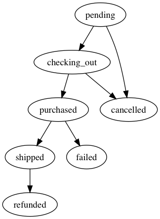

# StatesmanViz [](https://travis-ci.org/Sannim1/statesmanviz)

A tool for visualizing state machines defined using [Statesman](https://github.com/gocardless/statesman)

## Installation

Add this line to your application's Gemfile:

```ruby
gem 'statesman_viz'
```

And then execute:

    $ bundle

Or install it yourself as:

    $ gem install statesman_viz

## Usage
- Define a [Statesman](https://github.com/gocardless/statesman) state machine like below.

```ruby
class OrderStateMachine
  include Statesman::Machine

  state :pending, initial: true
  state :checking_out
  state :purchased
  state :shipped
  state :cancelled
  state :failed
  state :refunded

  transition from: :pending,      to: [:checking_out, :cancelled]
  transition from: :checking_out, to: [:purchased, :cancelled]
  transition from: :purchased,    to: [:shipped, :failed]
  transition from: :shipped,      to: :refunded

  guard_transition(to: :checking_out) do |order|
    order.products_in_stock?
  end

  before_transition(from: :checking_out, to: :cancelled) do |order, transition|
    order.reallocate_stock
  end

  before_transition(to: :purchased) do |order, transition|
    PaymentService.new(order).submit
  end

  after_transition(to: :purchased) do |order, transition|
    MailerService.order_confirmation(order).deliver
  end
end
```

- Invoke `StatesmanViz` to generate the state machine diagram.

```ruby
StatesmanViz.generate(OrderStateMachine)
```

- The output diagram is saved as `OrderStateMachine.png` in the current working directory.



## Development

TODO

<!-- After checking out the repo, run `bin/setup` to install dependencies. Then, run `rake spec` to run the tests. You can also run `bin/console` for an interactive prompt that will allow you to experiment.

To install this gem onto your local machine, run `bundle exec rake install`. To release a new version, update the version number in `version.rb`, and then run `bundle exec rake release`, which will create a git tag for the version, push git commits and tags, and push the `.gem` file to [rubygems.org](https://rubygems.org). -->

## Contributing

Bug reports and pull requests are welcome on GitHub at https://github.com/sannim1/statesmanviz. This project is intended to be a safe, welcoming space for collaboration, and contributors are expected to adhere to the [Contributor Covenant](http://contributor-covenant.org) code of conduct.

## License

The gem is available as open source under the terms of the [MIT License](https://opensource.org/licenses/MIT).

## Code of Conduct

Everyone interacting in the StatesmanViz project’s codebases, issue trackers, chat rooms and mailing lists is expected to follow the [code of conduct](https://github.com/sannim1/statesmanviz/blob/master/CODE_OF_CONDUCT.md).

## Credit

Thanks to [Tadas Sasnauskas](https://github.com/tadas-s) and the lovely people at [Ruby Hacknight - London](https://www.meetup.com/ruby-hacknight-london/) ❤️
